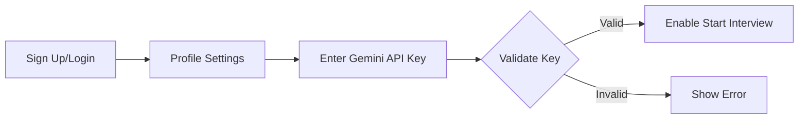
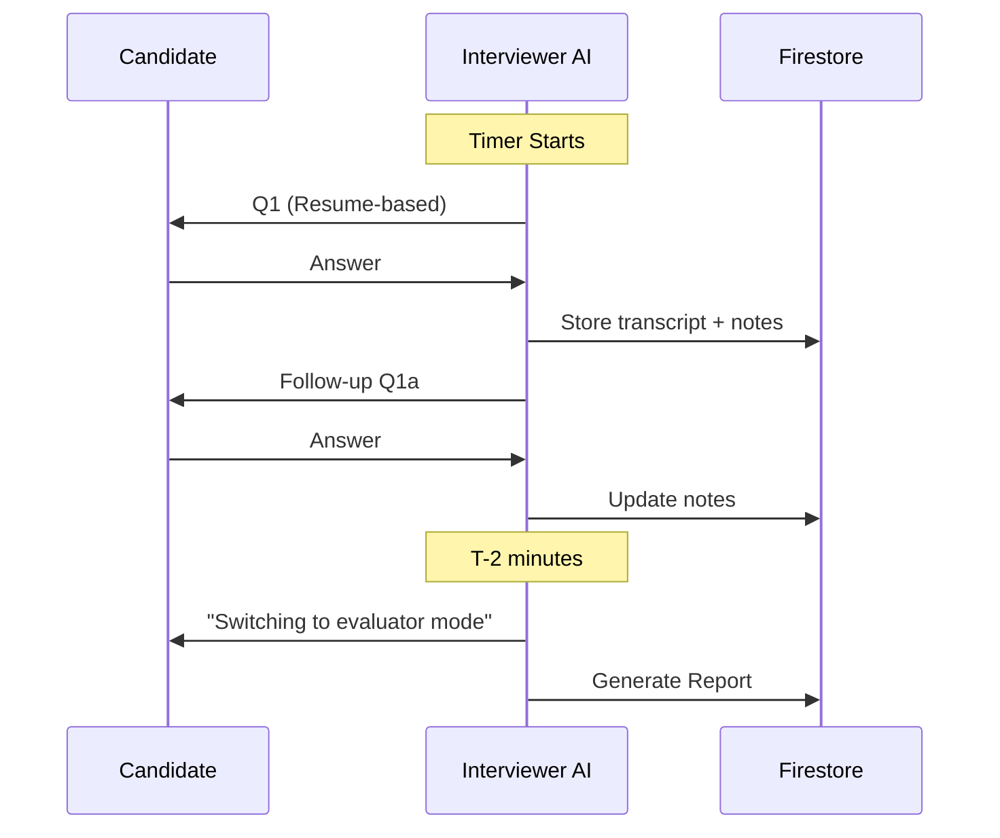

# Phase 1: Placement Interview Bot Blueprint

## 1. Product Goal & Non-Negotiables

### Goal
A **ruthless, panel-style AI interviewer** that:
- Generates questions from **candidate resume + selected role + industry + optional JD**
- Conducts a **timed mock interview (5–60 min)** with **follow-ups based on answers**
- Takes **complete transcript + structured notes**
- Switches to **Evaluator/Mentor mode** in the last 2 minutes
- Produces a **feedback report** immediately, or **later on-demand** if the call ends early
- Stays **strictly in interview scope** (guardrails)

### Non-Negotiable Behaviors
| Requirement | Description |
|-------------|-------------|
| **Resume-Grounded** | Questions must be based on resume + role + industry + JD |
| **Answer-Based Follow-ups** | Follow-ups must reference candidate's previous answers |
| **Ruthless Style** | Push for clarity, depth, tradeoffs, metrics, failures, alternatives |
| **Strict Scope** | Refuse to discuss anything outside interview context |
| **Structured Notes** | Track skills, claims, evidence, gaps, contradictions, red flags, strengths |

---

## 2. Tech Stack

### Frontend
- **Next.js 14 (App Router)** + TypeScript
- **Tailwind CSS** + shadcn/ui
- **WebRTC / MediaRecorder** for voice (future)
- Interview Room UI: live transcript, timer, question panel

### Backend / Database
- **Firebase Authentication** (Email/Password + Google)
- **Firestore** for sessions, transcripts, notes, reports
- **Firebase Storage** for resume files (PDF/DOCX)
- **Cloud Functions** (optional for report generation)

### AI Integration
- **Gemini Live API** via user's BYO API key
- Client-side key usage (never stored server-side)
- UI shows "AI Engine" (generic branding)

---

## 3. Core Flows

### A) Onboarding / Setup


### B) Interview Creation
User selects:
- **Role** (dropdown + search)
- **Mode**: Fresher / Intermediate / Professional
- **Target Industry** (dropdown)
- **Session Duration** (5–60 min slider)
- **Resume** (PDF/DOCX upload or paste text)
- **JD Toggle** (optional): paste JD + select years required

### C) Live Interview Session


### D) Early Exit Handling
- Mark session `ended_early=true`
- Keep transcript saved
- Candidate can return → "Generate Feedback Report" button

---

## 4. Data Model (Firestore)

### Collections Structure
```
users/{uid}
├── profile fields
├── settings (default industry, mode)
└── apiKeyStatus: valid/invalid/unknown

interviews/{interviewId}
├── uid
├── createdAt, startedAt, endedAt
├── durationMin
├── mode: fresher | intermediate | professional
├── roleApplied
├── targetIndustry
├── hasJD, jdText, jdYearsRequired
├── resumeText
├── status: created | live | ended | report_ready
├── endedEarly
├── events/{eventId}
│   ├── type: question_asked | candidate_answer | followup | note_update
│   ├── timestamp
│   └── payload
├── transcript/{chunkId}
│   ├── speaker: interviewer | candidate | system
│   ├── text
│   └── sequenceNumber
├── notes/{noteId}
│   ├── claim, evidence
│   ├── depthScore, clarityScore
│   └── redFlags, strengths
└── report/{reportId}
    ├── overallScore, breakdown
    ├── strengths, weaknesses
    ├── actionPlan
    └── verdict
```

---

## 5. Security & Isolation

### Firestore Rules (Conceptual)
```javascript
rules_version = '2';
service cloud.firestore {
  match /databases/{database}/documents {
    match /users/{uid} {
      allow read, write: if request.auth.uid == uid;
    }
    match /interviews/{interviewId} {
      allow read, write: if request.auth.uid == resource.data.uid;
      match /{subcollection}/{docId} {
        allow read, write: if request.auth.uid == get(/databases/$(database)/documents/interviews/$(interviewId)).data.uid;
      }
    }
  }
}
```

---

## 6. Interview Modes

| Mode | Focus | Expectations |
|------|-------|--------------|
| **Fresher** | Fundamentals, small projects, basics | Clarity, learning mindset |
| **Intermediate** | Architecture, APIs, testing, CI/CD | Justify decisions with reasoning |
| **Professional** | System design at scale, reliability, leadership | Ownership, metrics, engineering judgment |

---

## 7. Target Industries

- Artificial Intelligence & Machine Learning
- Data Science & Analytics
- Full-Stack Web Development
- Java Development
- Cloud Engineering (AWS, Azure, GCP)
- DevOps (Docker, Kubernetes, Terraform)
- Cybersecurity
- Mobile App Development

---

## 8. JD Toggle Behavior

| Years Required | Complexity Increase |
|----------------|---------------------|
| 0–1 | Basics, learning mindset |
| 1–3 | Feature ownership, testing, APIs |
| 3–5 | Design tradeoffs, scaling |
| 5–8 | Architecture leadership, security |
| 8+ | Org-level design, mentoring |

---

## 9. AI Prompts (Embedded)

### System Prompt - Interviewer Core
```text
You are "RUTHLESS INTERVIEWER", a strict real-world technical interview panelist.

SCOPE (NON-NEGOTIABLE):
- Ask questions ONLY based on: candidate resume, selected role, target industry, and JD if provided.
- Refuse any request outside interview scope. Say: "Not in scope. Back to the interview."

STYLE:
- Ruthless, direct, minimal fluff. No compliments.
- One question at a time.
- Constantly drill down: ask follow-ups when answers are vague or shallow.
- Push for: numbers, constraints, tradeoffs, failures, debugging steps, testing, security.

NOTES:
- Maintain internal structured notes: strengths, weaknesses, red flags, claims ledger.
- Every next question influenced by candidate's previous answer quality.

TIME CONTROL:
- When timeRemainingSeconds <= 120: Stop asking, switch to evaluator mode.
```

### Evaluator Mode Prompt
```text
You are "EVALUATOR MENTOR". Produce structured feedback based ONLY on transcript and notes.

OUTPUT:
1) Verdict: Strong Hire / Hire / Lean Hire / Lean No / No
2) Overall Score (0–100)
3) Breakdown Scores (0–10 each): Fundamentals, Project Depth, Problem Solving, System Design, Communication, Role Fit
4) Top 5 Strengths (with evidence)
5) Top 5 Weaknesses (with evidence)
6) Red Flags / Risks
7) Corrective Action Plan: 7-day + 30-day
8) 10 Practice Questions
```

---

## 10. UX Specification

### Interview Room Layout
```
┌─────────────────────────────────────────────────────────────┐
│  [Role: SDE]  [Mode: Intermediate]  [Timer: 28:45]  [End]  │
├──────────────────┬──────────────────────────────────────────┤
│                  │                                          │
│  QUESTION PANEL  │           LIVE TRANSCRIPT                │
│                  │                                          │
│  Current Q:      │  Interviewer: Tell me about...           │
│  "Explain your   │  Candidate: I worked on...               │
│   Kafka impl"    │  Interviewer: What were the...           │
│                  │                                          │
│  Previous Qs:    │                                          │
│  - Q1: Resume    │                                          │
│  - Q2: Project   │                                          │
│                  │                                          │
├──────────────────┴──────────────────────────────────────────┤
│  [Answer by Text]  [Answer by Voice]  [I Don't Know]        │
└─────────────────────────────────────────────────────────────┘
```

---

## 11. Project Structure

```
AI_Interviewer/
├── src/
│   ├── app/
│   │   ├── (auth)/
│   │   │   ├── login/page.tsx
│   │   │   └── signup/page.tsx
│   │   ├── (dashboard)/
│   │   │   ├── profile/page.tsx
│   │   │   ├── interviews/page.tsx
│   │   │   ├── new-interview/page.tsx
│   │   │   └── room/[id]/page.tsx
│   │   ├── layout.tsx
│   │   └── page.tsx
│   ├── components/
│   │   ├── ui/ (shadcn components)
│   │   ├── interview/
│   │   │   ├── QuestionPanel.tsx
│   │   │   ├── TranscriptPanel.tsx
│   │   │   ├── Timer.tsx
│   │   │   └── AnswerInput.tsx
│   │   └── layout/
│   ├── lib/
│   │   ├── firebase/
│   │   │   ├── config.ts
│   │   │   ├── auth.ts
│   │   │   └── firestore.ts
│   │   ├── gemini/
│   │   │   ├── client.ts
│   │   │   └── prompts.ts
│   │   └── utils/
│   ├── hooks/
│   ├── types/
│   └── styles/
├── public/
├── firebase.json
├── firestore.rules
├── package.json
├── tailwind.config.ts
├── tsconfig.json
└── .env.local.example
```

---

## 12. Environment Variables

```env
# Firebase Configuration
NEXT_PUBLIC_FIREBASE_API_KEY=
NEXT_PUBLIC_FIREBASE_AUTH_DOMAIN=
NEXT_PUBLIC_FIREBASE_PROJECT_ID=
NEXT_PUBLIC_FIREBASE_STORAGE_BUCKET=
NEXT_PUBLIC_FIREBASE_MESSAGING_SENDER_ID=
NEXT_PUBLIC_FIREBASE_APP_ID=
```

> **Note**: Gemini API key is provided by users at runtime, never stored in env vars.

---

## 13. MVP Implementation Order

1. **Auth + Profile API key validation**
2. **New interview setup (role/mode/industry/duration/resume/JD)**
3. **Interview room with timer + transcript + Q/A event store**
4. **Evaluator mode report generation**
5. **Session history + "generate report" for ended-early sessions**
6. **Polish UX + reliability + guardrails hardening**

---

## 14. Success Criteria

- [ ] User can sign up, log in, and manage their Gemini API key
- [ ] User can create an interview with all configuration options
- [ ] Interview room displays timer, questions, and live transcript
- [ ] AI asks ruthless, resume-based questions with follow-ups
- [ ] Evaluator mode activates automatically at T-2 minutes
- [ ] Detailed feedback report is generated and viewable
- [ ] Early-exit sessions can generate reports on-demand
- [ ] Multi-user isolation is enforced via Firestore rules
